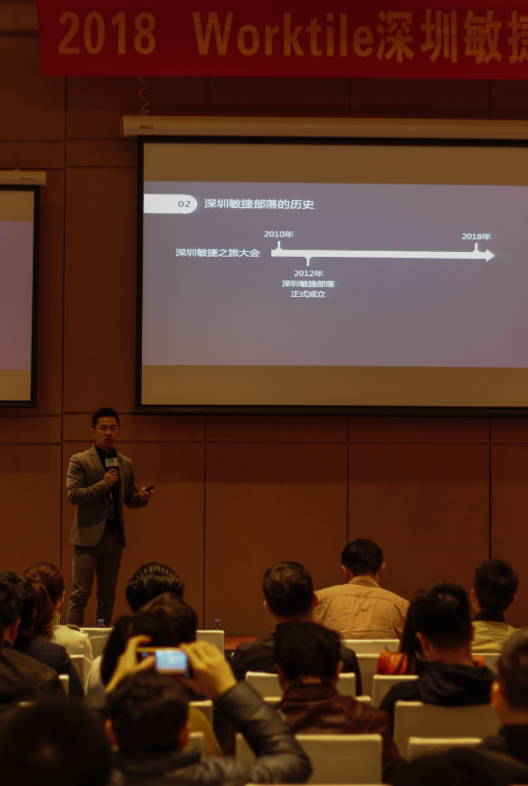

# 2018年深圳敏捷之旅圆满结束，附胶片下载

2018年12月15日早上，一年一度的全球敏捷之旅深圳站拉开帷幕，感受到听众小伙伴的热情高涨，部落小伙伴早早就过来准备好签到~

大伙都忙着在签名墙上留下自己的名字，找到你的名字了吗？

下面这两位部落小姐姐~

哦，她们是出来抢镜的~

灯~ 灯~ 灯~ ，活动要开始了，帅气的军少开始先介绍敏捷部落.

这是我们敏捷部落的历史~

好，下面小伙伴来集体亮个相？ 

什么，看不清？

2019年我们部落还策划了好多活动，过来你就有机会和我们的小伙伴面对面哦。

赞助方小姐姐，介绍~

小篇觉得前面是不是前面铺垫有点多，是不是都急着进入正题了。
来，有请我们的第一位嘉宾，黎嘉豪老师。

我忘了说今天嘉豪老师也忘记戴眼镜了，所以他看会场的小伙伴就像 ppt 上的主题图片一样。

首先一上来就让大家了解 Devops 目前所处的位置。

所以，你还在犹豫是否上 Devops 吗？那么干货来了：

接下来的第二个主题：
敏捷实干派创始人-莫敏老师分享的 《28天，敏捷方法从入门到放弃》

据说今天来了好多莫老师的粉丝~

来看看莫老师背后的男人：

最后，让我们实干吧~

来到了早上的最后一个主题，第三个主题：

来自 平安科技的  瞿俊龙，为我们带来 《大型产品特性化转型之路》

同样干货满满，这页 胶片 技术性比较强，不知道伙伴们都看懂没？

——————————————华丽的茶歇分割线——————————————

现在，来到下午的第一个主题：

创新产品研发咨询顾问的申健 分享的 《禅与复杂》

是不是有点神秘，一上来就让大家冥想一段时间。

再来重温各种角色之间的关系和状态。

下午的第二个主题：

顺丰科技 陈艳洁 《头狼敏捷工场 转型风口下的企业如何打造内部敏捷教练团队》

重温一下领航实战：

主会场下午的最后这个主题分享太精彩，会议结束了，还有好多小伙伴留下来提问:

范少波 腾讯互娱 《团队自驱力的挖掘与升华》

以人为本，打造团队正能量循环圈；小编觉着这张 胶片是点睛之笔。

好，以上都是主会场的~

重磅，下午分会场凤凰沙盘：

 Lean-Agile Coach 林伟丹 《**凤凰项目沙盘（体验版）**》

一共分成两组，一组由伟丹老师引导，一组由姚老师做引导。

效果怎么样? 看看听众小伙伴的朋友圈就知道了~

好了，今年的活动完美收官~

明年十周年，深圳见~

比心 n(*≧▽≦*)n ~

最后，附上你们期待已久的胶片下载地址：

链接: <https://pan.baidu.com/s/1qEj2OFnRSayOEatwSX3DTg> 提取码: g41a